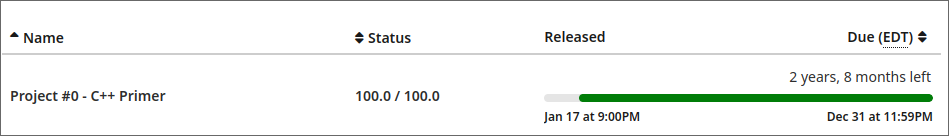

## 实验环境：

+ OS：ArchLinux
+ 编译器：clang++ >= 15.0，g++ >= 12.0
+ 构建系统：cmake >= 3.20
+ 编辑器：vscode, vim
+ 其他: 调试使用vscode-lldb

## Task1-实现Copy-On-Write字典树

主要实现三个接口：

+ `template <class T> auto Get(std::string_view key) const -> const T *;`
+ `template <class T> auto Put(std::string_view key, T value) const -> Trie;`
+ `auto Remove(std::string_view key) const -> Trie;`

（个人没有创建新的辅助函数，写下来发现，也无需创建）

首先，为了满足写时复制的特性，`Put`和`Remove`函数都不会在原来的节点上做修改，而是创建一个新的节点，然后在新的节点上做更新。`Get`操作比较简单，会根据`key` walk through Trie就可以了。对于`Put`的操作，要仔细考虑其插入的逻辑，
如果key char存在，创建的新节点是对旧节点的复制，即使用`Clone`，否则，需要自己创建新的节点。值得注意的是，要注意几个特殊的情况，第一，处理空Trie(`root_ == nullptr`)，不要一上来就假定`root_`是指向一个`TrieNode`的指针，然后进行一顿操作。第二，`key`为空的情况，即root也可能是带有value的节点。`Remove`操作的逻辑和`Put`类似，要考虑有子节点和没有子节点两种情况。

## Task2-并发存储

在实现Task1的基础上构建多线程并发。整个并发的逻辑是并发键值存储应该同时服务于多个读者和一个写者。也就是说，当有人在修改trie时，仍然可以对老根进行读操作。当有人正在阅读时，仍然可以执行写入而无需等待读取。

不难看出，在读取操作的时候，我们只需要先获取保护`root`的那个锁即可。值得注意的是一旦获取到当前的根，就可以释放该锁，因此需要考虑锁的范围大小。在写入的时候，因为是在新的根上操作，我们只要得到一个写锁即可，当写入完成，需要更新根的时候，我们需要获取保护根的锁，然后替换掉旧的根。删除操作同理。

## Task3-调试

我使用的是lldb调试，当前还只会一些简单的调试操作，比如打断点，前进，打印值等。

提交Grade遇到问题，答案无法通过，在discord上助教的解答如下：
> Alex Chi — 2023/02/15 23:29
It is possible that your environment produces different random numbers than the grading environment. In case your environment is producing different set of random numbers than our grader, replace your TrieDebugger test with:
```c++
  auto trie = Trie();
  trie = trie.Put<uint32_t>("65", 25);
  trie = trie.Put<uint32_t>("61", 65);
  trie = trie.Put<uint32_t>("82", 84);
  trie = trie.Put<uint32_t>("2", 42);
  trie = trie.Put<uint32_t>("16", 67);
  trie = trie.Put<uint32_t>("94", 53);
  trie = trie.Put<uint32_t>("20", 35);
  trie = trie.Put<uint32_t>("3", 57);
  trie = trie.Put<uint32_t>("93", 30);
  trie = trie.Put<uint32_t>("75", 29);
```

## Task4-SQL String Functions

简而言之就是感受一下sql调用的函数如何实现，注册的。一个是`lower`转换，一个是`upper`转换，没什么难度。

## 提交结果

